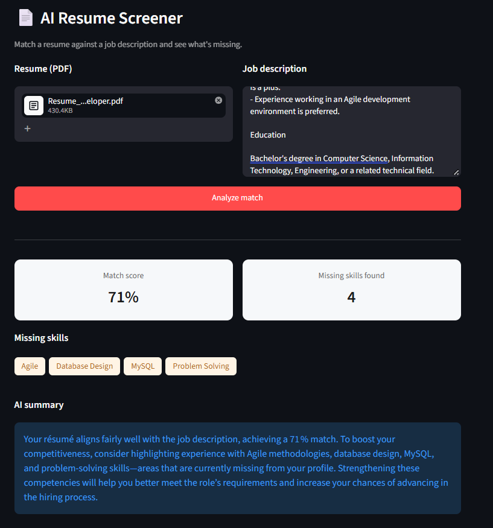

# AI Resume Screener

Match a resume against a job description in seconds — get a similarity score, a list of missing skills, and a plain-English summary of the fit, powered by embeddings and an LLM.


<!-- Replace docs/screenshot.png with an actual screenshot of the running app -->

## Why this project

Most "resume matcher" projects stop at keyword overlap, which misses candidates who describe the same skill differently (e.g. "led a team of 5" vs. "team leadership"). This project combines semantic similarity (via embeddings) with explicit keyword-gap detection, then uses an LLM to turn the raw numbers into a short, readable explanation — closer to how a human reviewer would actually read a resume.

## How it works
Resume (PDF) ──┐
├──► Text extraction (pdfplumber)
Job Description ─┘
│
▼
┌───────────────┴───────────────┐
│ │
Embedding similarity Keyword gap analysis
(Gemini API) (spaCy)
│ │
└───────────────┬───────────────┘
▼
LLM-generated summary (Groq)
│
▼
Streamlit UI


## Tech stack

- **Frontend:** Streamlit
- **PDF parsing:** pdfplumber
- **Embeddings / semantic similarity:** Gemini API
- **Keyword extraction:** Curated skill taxonomy with regex-based variant matching
- **Natural-language summary:** Groq API (LLM)

## A technical detail worth mentioning

Raw embedding similarity scores from the Gemini API weren't well-calibrated out of the box — an effect known as anisotropy, where all embeddings cluster too closely together in vector space, compressing the useful range of similarity scores. This was diagnosed and fixed by calibrating scores against a baseline rather than trusting raw cosine similarity, which produced far more meaningful, spread-out match percentages. The full debugging process — including how the issue was first spotted, the hypotheses ruled out, and the eventual fix — is documented in [`notes/learnings.md`](notes/learnings.md).

## Setup

1. Clone the repo and create a virtual environment:
```bash
   git clone <your-repo-url>
   cd ai-resume-screener
   python -m venv venv
   venv\Scripts\activate   # Windows
   source venv/bin/activate  # macOS/Linux
```

2. Install dependencies:
```bash
   pip install -r requirements.txt
```

3. Add your API keys. Create a `.env` file in the project root:
GEMINI_API_KEY=your_key_here 
GROQ_API_KEY=your_key_here Save the file.


4. Run the app:
```bash
   streamlit run app.py
```
   This opens the app at `http://localhost:8501`.

## Live demo

🔗 [Live app link — coming soon]

## Project structure

ai-resume-screener/
├── app.py # Streamlit frontend
├── src/
│ ├── parser.py # PDF text extraction
│ ├── embedder.py # Embedding similarity (Gemini API)
│ ├── keyword_analysis.py # Keyword gap analysis (spaCy)
│ └── llm_explainer.py # LLM-generated summary (Groq API)
├── data/
│ ├── sample_resumes/
│ └── sample_jds/
├── notes/
│ └── learnings.md # Debugging log and technical write-ups
└── requirements.txt


## What I'd improve next

- Support for multiple resume formats (DOCX, plain text)
- Batch mode: screen multiple resumes against one job description at once
- More granular skill-matching (weighting by seniority/years of experience, not just presence/absence)

